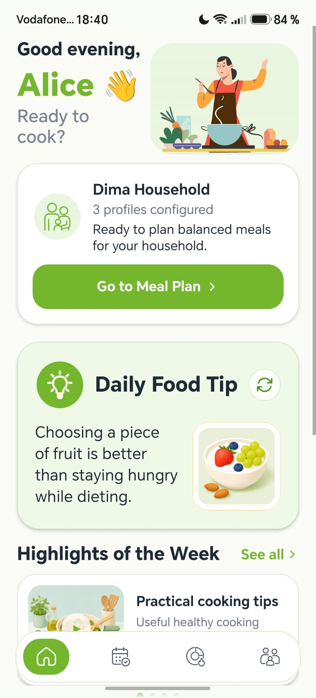
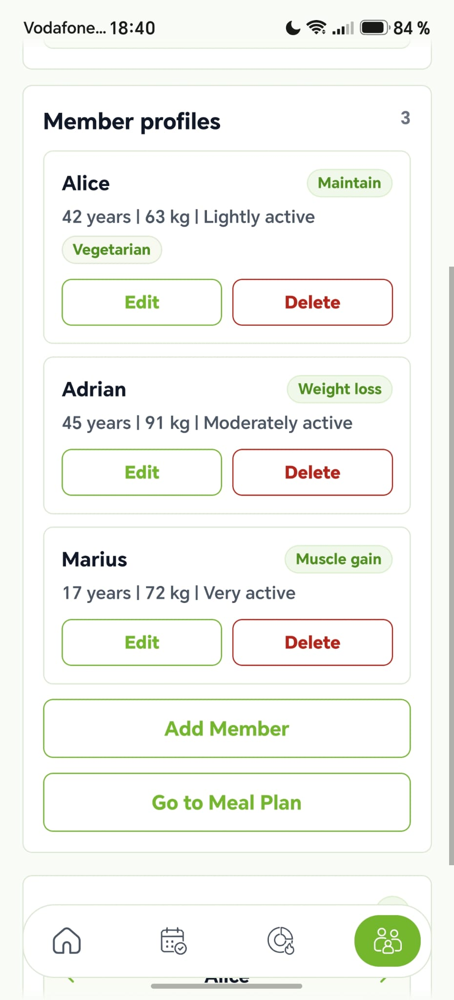
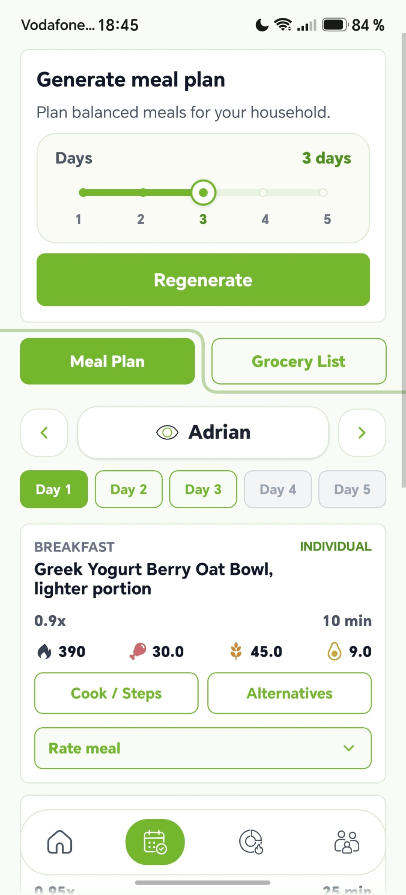
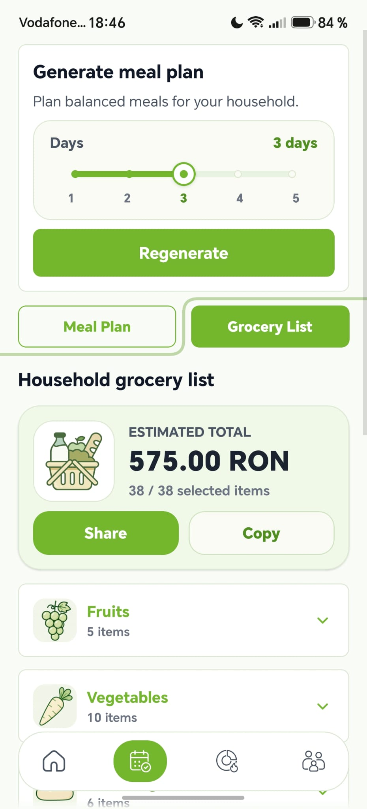
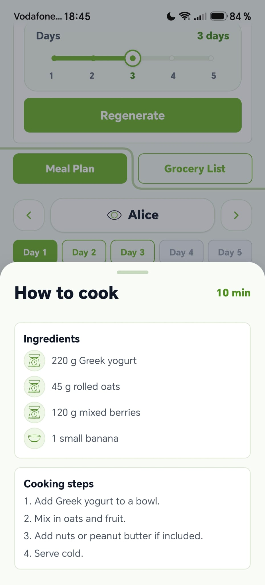
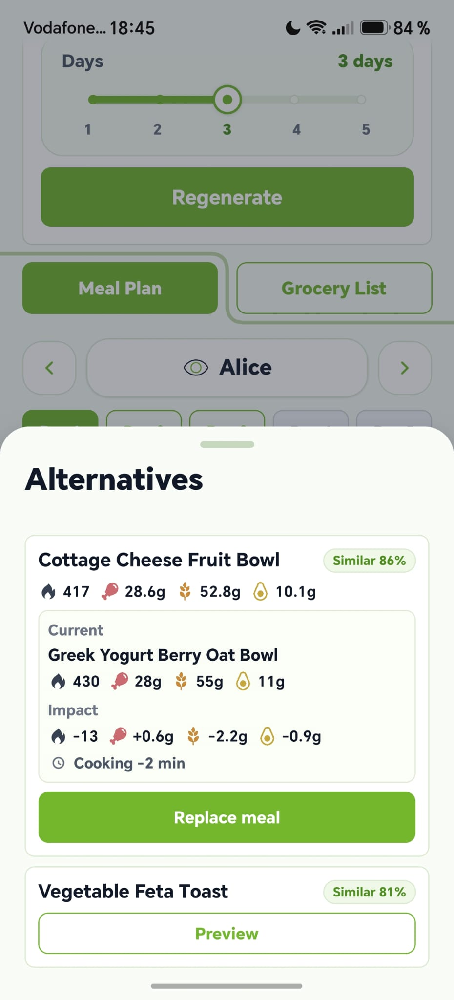
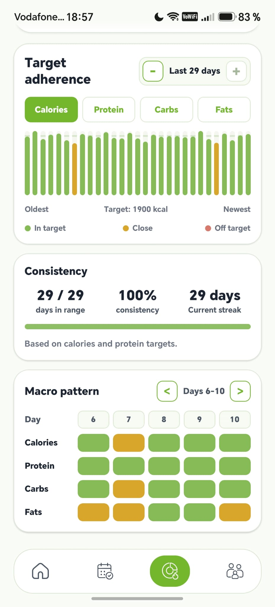

# TableTogether

TableTogether is a household meal-planning application that generates multi-day meal plans for families with multiple member profiles, different goals, preferences and dietary restrictions. It combines a React Native / Expo mobile app, a FastAPI backend, a deterministic Python planning engine, curated food and recipe datasets, and local SQLite persistence.

The project was built as a bachelor thesis / portfolio system, with emphasis on clear data separation, backend orchestration, recipe-based planning, grocery aggregation and feedback-aware iteration.

<p align="center">
  
</p>

## Demo

A short product demo video is planned for this section.

<!-- TODO: Add the final demo video link or portfolio site link here. Do not commit a large MP4 file to the repository. -->

## Overview

Most meal-planning tools focus on one person. TableTogether focuses on the household:

- one account can contain several internal member profiles;
- each member can have different goals, preferences and restrictions;
- the generator can produce an individual or household-level plan;
- generated meals can be inspected, replaced, rated and turned into a grocery list;
- saved daily progress can later be used by the Insights page.

The current implementation is local-first: the mobile app talks to a locally running backend, and the backend persists runtime data in SQLite.

## Key Features

- Local account registration and login.
- Household and member profile management.
- Nutrition goals based on member profile data.
- Dietary restrictions and non-clinical health-aware preference modes.
- Individual and household meal-plan generation for 1-5 days.
- Recipe-based planning with scoring, filtering and portion allocation.
- Cooking steps and scaled ingredient amounts for generated recipes.
- Recipe alternatives using KNN-lite candidate retrieval plus backend approval.
- Meal replacement preview and apply flow.
- Meal feedback: liked, disliked, too long and explicit avoid.
- Deterministic grocery list generation with categories, purchase suggestions and estimated prices.
- Insights page with eaten-meal tracking, daily progress snapshots and trends.

<p align="center">
  
  
  
</p>

## Application Flow

```text
User / Household
  -> React Native + Expo mobile app
  -> API client over HTTP/JSON
  -> FastAPI backend
  -> Python generator service
  -> Food_DB + Recipes_DB
  -> SQLite persistence
  -> mobile meal plan, grocery list, feedback and insights
```

The mobile app does not read CSV files and does not run the generator directly. It sends requests to the backend, receives JSON responses and renders the user-facing experience.

## Architecture

The current runtime architecture is intentionally split by responsibility:

- `mobile/` contains the React Native / Expo app, UI state, screens, assets and API client.
- `backend/` exposes FastAPI routes, validates requests, manages local SQLite persistence and orchestrates generation.
- `src/generator_v1/` contains the Python planning engine and related scoring, filtering, grocery, feedback and replacement logic.
- `data/fooddb/current/` contains the active canonical food table.
- `data/recipesdb/current/` contains the active app-facing recipe dataset.
- `data/grocery/reference/` contains purchase, conversion and estimated price reference tables.

SQLite is backend-owned persistence for accounts, sessions, households, profiles, feedback, generated plans, grocery lists and saved daily progress snapshots.

## Planning Engine

The generator is recipe-based and deterministic rather than ML-first. It starts from member profiles and nutrition targets, loads recipe candidates, applies filters and profile guards, scores candidate meals, selects a day or multi-day plan, then builds the response expected by the mobile app.

Important pieces:

- profile and household target building;
- dietary and preference filtering;
- slot-level candidate construction for breakfast, lunch, dinner and snack;
- macro, time, slot, feedback and health/diet fit scoring;
- multi-day no-repeat behavior;
- household allocation and member-level portion scaling;
- grocery aggregation from selected recipe ingredients;
- KNN-lite alternatives as an auxiliary recipe-retrieval layer;
- replacement preview before applying a meal change.

KNN-lite is not the main generator. It supports the Alternatives screen by finding similar recipes, after which the backend/generator flow validates whether a replacement can be applied.

<p align="center">
  
  
</p>

## Data Layer

Current app-facing data:

- Food_DB: `data/fooddb/current/fooddb_current.csv`
  - 1,537 curated canonical food rows.
- Recipes_DB: `data/recipesdb/current/`
  - 326 app-facing recipes;
  - 2,498 recipe ingredient rows;
  - 326 recipe nutrition cache rows.
- Grocery reference data: `data/grocery/reference/`
  - purchase rules;
  - cooked-to-raw helpers;
  - product catalog;
  - aliases;
  - estimated price fallbacks.

Raw upstream datasets and historical drafts are intentionally not distributed in the public repository. The checked-in current data is the curated app-facing layer used by the generator.

## Tech Stack

Mobile:

- TypeScript
- React Native
- Expo SDK 56
- `react-native-svg`
- `lottie-react-native`

Backend and generator:

- Python
- FastAPI
- Uvicorn
- SQLite
- CSV / JSON data files
- local validation and QA scripts

Documentation and tooling:

- Markdown documentation
- PowerShell-friendly local commands
- Python check scripts under `tools/extra/`

## Project Structure

```text
backend/                  FastAPI app, routes, schemas and SQLite repositories
mobile/                   React Native / Expo mobile application
src/generator_v1/         Recipe-based planning engine
data/fooddb/current/      Active canonical food dataset
data/recipesdb/current/   Active app-facing recipe dataset
data/grocery/reference/   Grocery formatting, package and price references
docs/                     Technical documentation and architecture notes
tools/extra/              Smoke tests, audits and validation helpers
profiles/                 Local sample profile inputs
```

For deeper subsystem notes, see:

- [Backend README](backend/README_backend.md)
- [Mobile README](mobile/README_mobile.md)
- [Technical documentation index](docs/README.md)
- [Current architecture](docs/architecture/current.md)
- [Generator demo guide](docs/demo/generator_v1_demo_guide.md)
- [Food_DB current](data/fooddb/current/README.md)
- [Recipes_DB current](data/recipesdb/current/README.md)
- [Grocery reference data](data/grocery/reference/README.md)

## Running Locally

Prerequisites:

- Python 3.11+ recommended.
- Node.js and npm.
- Expo-compatible Android emulator or physical Android device.

Install backend dependencies from the repository root:

```powershell
pip install -r backend/requirements_backend.txt
```

Start the backend:

```powershell
uvicorn backend.app.main:app --host 0.0.0.0 --port 8000 --reload
```

Install mobile dependencies:

```powershell
cd mobile
npm install
```

Start Expo for an Android emulator:

```powershell
npx expo start --android
```

For a physical phone on the same network, set the API base URL to the computer LAN address:

```powershell
$env:EXPO_PUBLIC_API_BASE_URL='http://<PC_LAN_IP>:8000'
npx expo start --go --host lan
```

For USB-based local testing, Android `adb reverse` can be used:

```powershell
adb reverse tcp:8000 tcp:8000
adb reverse tcp:8081 tcp:8081
$env:EXPO_PUBLIC_API_BASE_URL='http://127.0.0.1:8000'
npx expo start --host lan --port 8081 --clear
```

The default backend SQLite database is created under:

```text
data/runtime/tabletogether_demo.db
```

`data/runtime/` is local runtime state and is ignored by Git.

## Verification

Useful checks:

```powershell
python -m compileall backend tools/extra src/generator_v1 src/generator_v1_cli.py
python tools/extra/check_backend_m5_persistence_aware_generation.py
python tools/extra/check_backend_knn_recipe_alternatives.py
python tools/extra/check_backend_knn_meal_replacement.py
python tools/extra/check_progress_daily_snapshots.py
python tools/extra/check_progress_trends_backend.py
python tools/extra/check_data_qa_price_time_no_missing.py
```

Mobile checks:

```powershell
cd mobile
npx tsc --noEmit
npx expo install --check
```

## Technical Highlights

- End-to-end local flow from mobile UI to backend to Python generator to SQLite persistence.
- Clean separation between canonical food data and recipe data.
- Recipe-centered generation instead of assembling arbitrary ingredient combinations.
- Deterministic grocery aggregation from generated plans.
- Feedback-aware future generation without presenting the system as a recommender ML model.
- Explicit replacement preview flow before changing a generated meal.
- Mobile UI structured around the real product flows: Home, Meal Plan/Grocery, Insights and Household/Account.

<p align="center">
  
</p>

## Scope And Limitations

This is a local-first thesis/portfolio application, not a production nutrition platform.

Current limitations:

- no cloud deployment or multi-device sync;
- local authentication without email verification or password reset email;
- static estimated prices, not live supermarket prices;
- no real pantry inventory or store optimization;
- no clinical validation and no medical advice;
- no complete micronutrient analysis;
- recipe-level alternatives and replacement, not ingredient-level substitution;
- current Food_DB / Recipes_DB are curated app-facing datasets, not complete public nutrition or recipe databases.

## Further Documentation

The repository contains more detailed subsystem notes in `docs/`, plus focused README files for backend, mobile and active data folders. Start with [docs/README.md](docs/README.md) if you want the longer technical trail.

## License

Copyright © 2026 Șerban Beniamin. All rights reserved.

This project is publicly available for portfolio and educational review purposes. See [LICENSE](LICENSE) for details.
